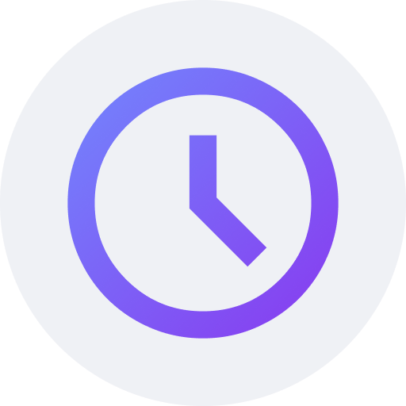

<!-- ---------- Header ---------- -->

  
  <h1>Clock You</h1>

Powerful clock app using <a href="https://m3.material.io/">Material Design 3 (You)</a> and Jetpack Compose.

<!-- ---------- Description ---------- -->
## Features

- [x] Material Design 3 (You)
- [x] Dark and light theme
- [X] Integrated clock, alarm, timer and stopwatch
- [X] Convenient user interface
- [X] Written in Jetpack Compose 

<!-- ---------- Download ---------- -->
## Download

<!-- ---------- Contribution ---------- -->
## Feedback and contributions
***All contributions are very welcome!***
